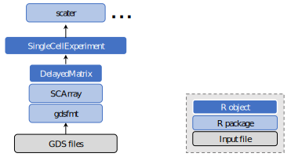

## Introduction

The SCArray package provides large-scale single-cell RNA-seq data manipulation using Genomic Data Structure ([GDS](http://www.bioconductor.org/packages/gdsfmt)) files. It combines dense/sparse matrices stored in GDS files and the Bioconductor infrastructure framework ([SingleCellExperiment](http://www.bioconductor.org/packages/SingleCellExperiment) and [DelayedArray](http://www.bioconductor.org/packages/DelayedArray)) to provide out-of-memory data storage and manipulation using the R programming language. As shown in the figure, SCArray provides a `SingleCellExperiment` object for downstream data analyses. GDS is an alternative to HDF5. Unlike HDF5, GDS supports the direct storage of a sparse matrix without converting it to multiple vectors.




## Installation

* Requires R (>= v3.5.0), [gdsfmt](http://www.bioconductor.org/packages/gdsfmt) (>= v1.24.0)

* Bioconductor repository
```R
if (!requireNamespace("BiocManager", quietly=TRUE))
    install.packages("BiocManager")
BiocManager::install("SCArray")
```


## Format conversion

```{r}
suppressPackageStartupMessages(library(SCArray))
suppressPackageStartupMessages(library(SingleCellExperiment))

# load a SingleCellExperiment object
fn <- system.file("extdata", "LaMannoBrainSub.rds", package="SCArray")
sce <- readRDS(fn)

# Convert it to a GDS file
scConvGDS(sce, "test.gds")
```


## Single Cell Datasets

```{r}
# a GDS file for SingleCellExperiment
fn <- system.file("extdata", "LaMannoBrainData.gds", package="SCArray")

sce <- scExperiment(fn)
sce

# it is a DelayedMatrix, not loaded
assays(sce)$counts

# row and column data
colData(sce)
rowData(sce)
```


# Session Info

```{r}
sessionInfo()
```

```{r echo=FALSE}
unlink("test.gds", force=TRUE)
```
